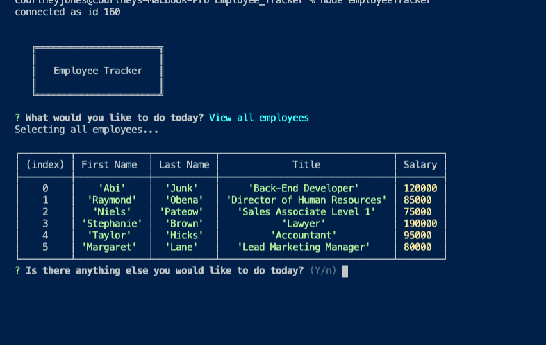

# Unit 12 MySQL Homework: Employee Tracker

```
As a business owner
I want to be able to view and manage the departments, roles, and employees in my company
So that I can organize and plan my business
```

# Description

This CLI application allows a user to CREATE, READ, UPDATE, and DELETE items within a database of employees. 


```
The user is able to: 

View all employees
Veiw all employees by department
View all employees by manager
Add a new employee
Add a new Role
Add a new Department
Remove an employee
Update an employees Role
```

# App Demo

[](https://drive.google.com/file/d/1Yu6O_5LPNtrT5SLD81-WvrHYyDxDNyIX/view)